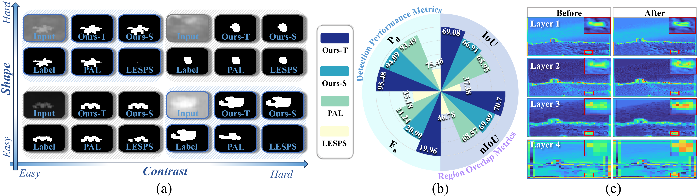
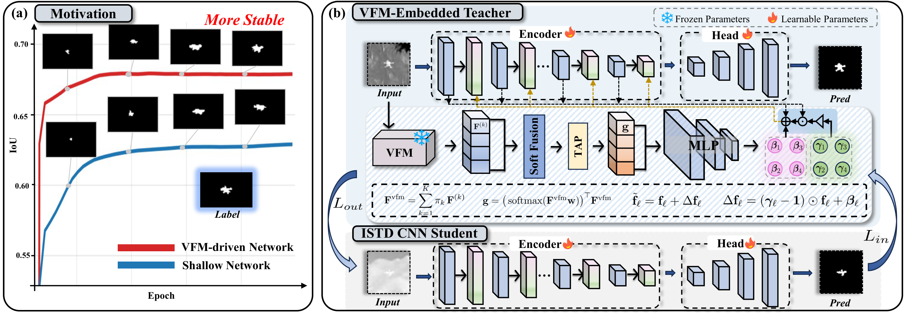
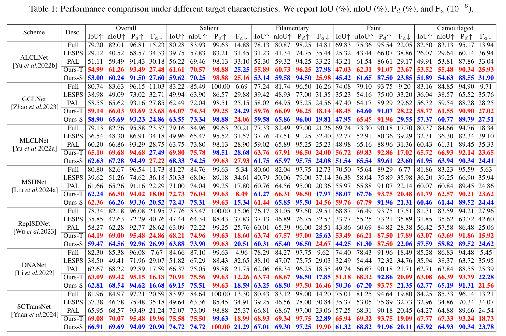
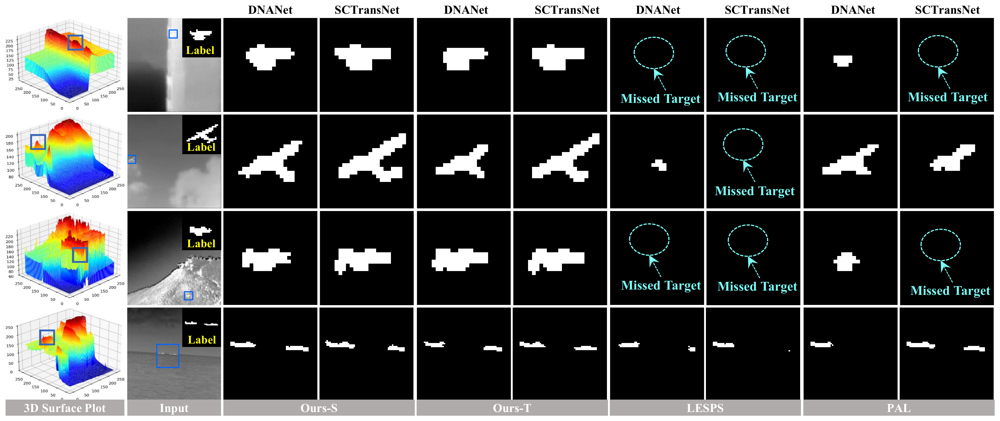

# Learning with Semantic Priors (IJCAI-ECAI 2026)

<div align="center">
<h3>Learning with Semantic Priors: Stabilizing Point-Supervised Infrared Small<br>
Target Detection via Hierarchical Knowledge Distillation</h3>


[](#)
[](#)
[](LICENSE)

[arXiv](http://arxiv.org/abs/2605.14346)

</div>

## Introduction

**Learning with Semantic Priors** focuses on point-supervised infrared small-target detection (ISTD). Single-point annotations reduce the cost of dense masks, but online pseudo-mask evolution can become unstable when lightweight CNN detectors lack sufficient semantic discrimination. This is especially problematic for faint, filamentary, and camouflaged targets.

The proposed framework stabilizes point-supervised learning by using a frozen Vision Foundation Model (VFM) **only during training** and distilling its semantic priors into a lightweight student detector:

- **Hierarchical VFM-driven distillation:** a VFM-embedded teacher guides a deployable CNN student with validation-oriented bi-level optimization.
- **Semantic-Conditioned Affine Modulation (SCAM):** VFM semantics are injected into multi-layer CNN features through lightweight affine modulation.
- **Dynamic collaborative learning:** cluster-level sample reweighting improves robustness to noisy pseudo-masks and imbalanced target characteristics.

<p align="center">
  
</p>

> Efficiency overview.

<p align="center">
  
</p>

> Motivation and the proposed framework.

## Code Usage

### Step 1. Clone this repository and create environment

```bash
git clone https://github.com/yuanhang-yao/semantic-prior.git
cd semantic-prior

conda create -n semantic-prior python=3.10 -y
conda activate semantic-prior
pip install -r requirements.txt
```

### Step 2. Prepare DINOv3 weights

The VFM teacher uses DINOv3 ViT-S+/16 during training.

```text
facebook/dinov3-vits16plus-pretrain-lvd1689m
```

Recommended options:

```bash
# Option A: load directly from Hugging Face during training
huggingface-cli login

# Option B: download/cache the model in advance and set the local path in config
export HF_HOME=/path/to/huggingface_cache
```

### Step 3. Prepare datasets

[SIRST3](https://github.com/YuChuang1205/PAL)

Expected directory structure:

```text
datasets/
└── SIRST3/
    ├── images/
    ├── labels/
    ├── masks_centroid/
    └── mode/
        ├── train.txt
        ├── val.txt
        └── test.txt
```

### Step 4. Generate cluster-level image priors

```bash
python utils/generate_cluster_csv.py \
  --dataset_root ./datasets/SIRST3 \
  --save_path ./datasets/SIRST3/cluster_priors.csv
```

### Step 5. Train

```bash
python train.py \
  --model ALCL \
  --dataset_root ./datasets/SIRST3 \
  --epochs 300 \
  --batch_size 16 \
  --lr_inner 5e-4 \
  --lr_outer 5e-4 \
  --lr_alpha 5e-4 \
  --gpu_id 0 \
  --save_tag exp
```

### Step 6. Test

```bash
python test.py \
  --model ALCL \
  --checkpoint ckpts/best_student_mIoU_exp.pth \
  --dataset_root ./datasets/SIRST3 \
  --output_dir ./outputs/alcl_student \
  --gpu_id 0
```

## Main Results

<details>
<summary><strong>Overall and characteristic-wise results</strong></summary>
<p align="center">
  
</p>
</details>

<details>
<summary><strong>Qualitative results</strong></summary>
<p align="center">
  
</p>
</details>

## Citation

If this project is useful for your research, please cite:

```bibtex
@inproceedings{yao2026semanticpriors,
  title     = {Learning with Semantic Priors: Stabilizing Point-Supervised Infrared Small Target Detection via Hierarchical Knowledge Distillation},
  author    = {Yao, Yuanhang and Qian, Ping and Liu, Zhu and Ma, Long and Wang, Weimin},
  booktitle = {Proceedings of the International Joint Conference on Artificial Intelligence},
  year      = {2026}
}
```
